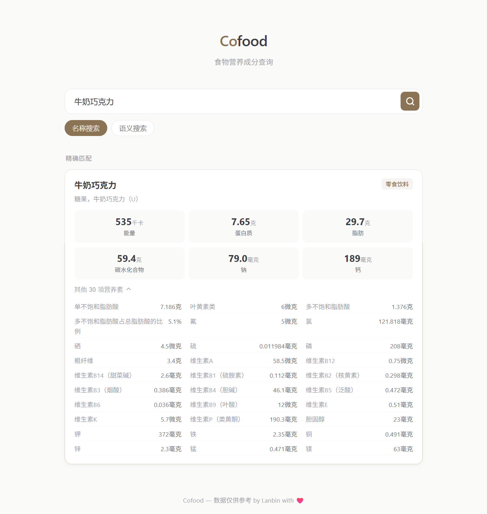

# Cofood

Cofood 是一个基于 Go + Gin 的食物营养搜索服务，内置 SQLite 存储、关键词检索、向量检索，以及一个可直接访问的轻量 Web 界面。

仓库内已附带可直接运行的示例数据库 `data/cofood.db`，因此默认配置下开箱即用。项目也保留了 `food-table.jsonl` 原始数据源；如果你希望重新导入或重建数据库，启动时同样支持从 JSONL 自动导入。配置了 SiliconFlow API Key 后，还可以在启动阶段批量生成 embedding，支持语义搜索。



## Features

- 自动导入 `food-table.jsonl` 到 SQLite，并结构化保存食物、别名和营养项
- 仓库自带示例数据库 `data/cofood.db`，拉取后即可直接运行
- 支持名称精确匹配和关键词搜索
- 支持基于 embedding 的语义搜索
- 首页直接提供单页查询界面，无需额外前端构建
- 内置多时间窗限流，保护公开接口

## Tech Stack

- Go
- Gin
- SQLite
- SiliconFlow Embeddings
- 原生 HTML / CSS / JavaScript

## Quick Start

1. 直接启动服务

```bash
go run .
```

2. 打开浏览器访问

```text
http://localhost:8080
```

默认会使用仓库中的 `data/cofood.db` 作为数据源，因此不需要额外初始化步骤。

3. 按需复制环境变量模板并覆盖默认配置

```bash
cp .env.example .env
```

常见场景：

- 只体验关键词搜索时，可直接使用默认配置，甚至可以不创建 `.env`
- 需要语义搜索时，设置 `SILICONFLOW_API_KEY`
- 需要启动时自动补全 embedding 时，设置 `AUTO_EMBED_ON_STARTUP=true`
- 需要从原始 JSONL 重建库时，可删除 `data/cofood.db` 或将 `DATABASE_PATH` 指向新的数据库文件

## Configuration

主要环境变量如下：

| Name | Default | Description |
| --- | --- | --- |
| `APP_HOST` | `0.0.0.0` | 服务监听地址 |
| `APP_PORT` | `8080` | 服务端口 |
| `DATABASE_PATH` | `data/cofood.db` | SQLite 数据文件路径，仓库已附带示例库 |
| `DATA_FILE_PATH` | `food-table.jsonl` | 原始食物数据源，用于首次导入或重建数据库 |
| `SILICONFLOW_API_KEY` | empty | SiliconFlow API Key |
| `EMBEDDING_MODEL` | `Qwen/Qwen3-Embedding-8B` | embedding 模型 |
| `AUTO_EMBED_ON_STARTUP` | `false` | 启动时是否自动补全 embedding |
| `EMBEDDING_BATCH_SIZE` | `16` | embedding 批处理大小 |

完整示例见 [`.env.example`](.env.example)。

## API

### Health Check

```http
GET /healthz
```

### Name Search

```http
GET /api/v1/search/name?q=葡萄酒
```

### Vector Search

```http
GET /api/v1/search/vector?q=适合做沙拉的鱼
```

当未配置 embedding 或尚未加载向量索引时，向量接口仍会返回精确匹配结果，并在响应中标记 `embedding_loaded=false`。

## Included Data

仓库当前附带的示例数据库内容：

- `foods`: 1643 条
- `food_aliases`: 5747 条
- `food_nutrients`: 88722 条
- `food_embeddings`: 1643 条

这意味着默认情况下不仅可以做名称检索，也可以直接体验向量检索。

## Rate Limit

同一 IP 的默认限制：

- 1 秒最多 20 次请求
- 1 分钟最多 120 次请求
- 1 小时最多 1200 次请求

任一窗口超限都会返回 `429 Too Many Requests`。

## Project Structure

```text
.
|-- internal/
|   |-- api/          HTTP 路由与处理器
|   |-- database/     SQLite 访问与 schema
|   |-- embedding/    SiliconFlow embedding 客户端
|   |-- importer/     JSONL 导入与 embedding 回填
|   |-- search/       搜索服务
|   `-- vector/       内存向量索引
|-- data/
|   `-- cofood.db     开箱即用的示例 SQLite 数据库
|-- web/              单页查询界面
|-- docs/             README 资源
`-- food-table.jsonl  原始 JSONL 数据源
```
